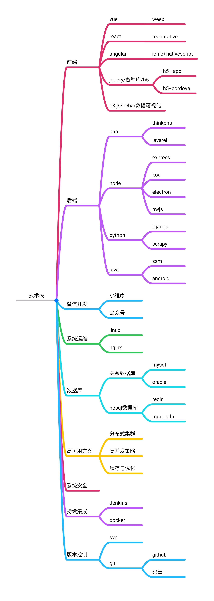

# 个人技术栈如下：

## vue/vux/weex
## node/koa2/Express
## php/ThinkPHP
## mysql/mongodb

# 后续路线
## iview ui/element ui
## java/ssm/Android
## Object-C/iOS
## 微信小程序
## 微信公众号
## 持续集成
## 分布式
## linux
## nginx

## 

## 微信：伟岸的我

